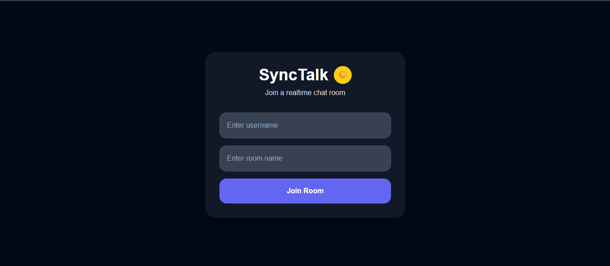

# SyncTalk 🚀

A modern real-time chat application built with **React, Node.js, Socket.IO, and MongoDB** that enables instant communication through room-based messaging.

SyncTalk provides a fast and responsive real-time chat experience with persistent message storage, modern UI design, and scalable client-server architecture.

---

## 🌐 Live Demo

### Frontend
https://synctalk.vercel.app/

### Backend
https://synctalk-backend-w7lj.onrender.com

---

# ✨ Features

- ⚡ Real-time messaging using Socket.IO
- 🏠 Room-based chat system
- 👤 Username support
- 🌙 Dark / Light mode toggle
- 💾 MongoDB cloud database integration
- 🔄 Persistent chat history
- 📱 Responsive modern UI
- ☁️ Fully deployed frontend & backend
- 🚀 Fast Vite-powered frontend

---

# 🛠️ Tech Stack

## Frontend
- React.js
- Vite
- Tailwind CSS
- Socket.IO Client

## Backend
- Node.js
- Express.js
- Socket.IO
- MongoDB Atlas
- Mongoose

## Deployment
- Vercel (Frontend)
- Render (Backend)

---

## 📸 Screenshots

### Join Room Screen



---

### Desktop Chat Interface


---

### Toggle Mmode Interface


---

### Mobile Chat Interface


---

### Typing Feature


---

### Active Users Sidebar


---

# ⚙️ Local Installation

## 1. Clone Repository

```bash
git clone https://github.com/roshankodi/synctalk.git
cd synctalk
```

---

## 2. Install Frontend Dependencies

```bash
cd client
npm install
```

---

## 3. Install Backend Dependencies

```bash
cd ../server
npm install
```

---

# 🔐 Environment Variables

Create a `.env` file inside the `server` folder:

```env
MONGO_URI=your_mongodb_connection_string
PORT=5000
```

---

# ▶️ Run Locally

## Start Backend

```bash
cd server
npm start
```

## Start Frontend

```bash
cd client
npm run dev
```

Frontend runs on:

```plaintext
http://localhost:5173
```

---

# 🧠 Project Architecture

```plaintext
Client (React + Socket.IO)
        ↓
Node.js + Express Server
        ↓
Socket.IO Realtime Communication
        ↓
MongoDB Atlas Database
```

---

# 🚀 Future Improvements

- 🔐 Authentication & Authorization
- 👥 Presence / Online status
- 📎 File & image sharing
- 🖼️ User profile avatars
- 💬 Direct messaging
- 📱 Progressive Web App (PWA)
- 🔍 Chat search functionality
- 🌍 Multi-language support

---

# 📌 Key Learnings

This project helped strengthen concepts in:
- Real-time communication
- Full-stack application architecture
- WebSocket implementation
- MongoDB integration
- Cloud deployment
- React state management
- Responsive UI development

---

# 👨‍💻 Author

## Roshan Kodi

- GitHub: https://github.com/roshankodi
- LinkedIn: https://linkedin.com/in/kodi-roshan-78858b356
- Portfolio:  https://roshankodi.github.io/portfolio-me/

---

# ⭐ Support

If you like this project, consider giving it a star on GitHub ⭐

⭐ Star the repository to support development.